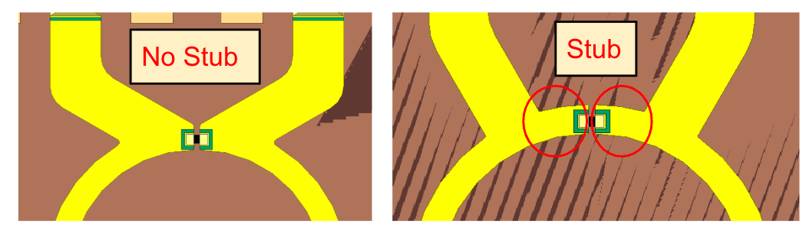
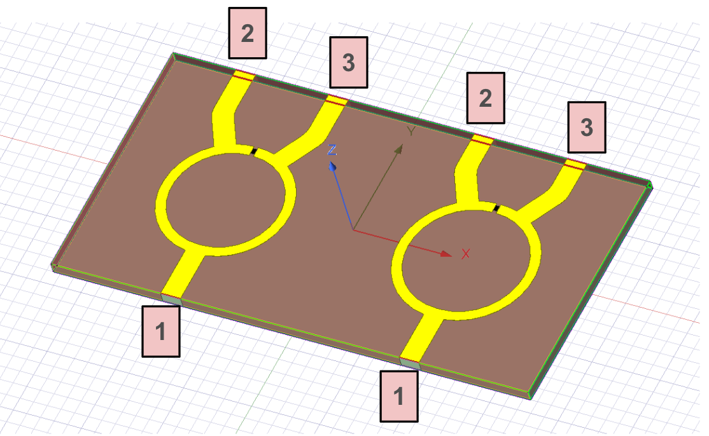
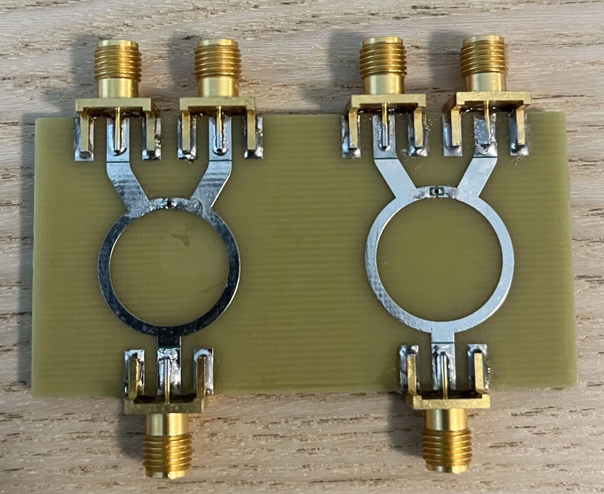

# FR4 Wilkinson Power Divider

This is a S-band dual-channel Wilkinson power divider designed for the UTAT (University of Toronto Aerospace Team) CubeSat RF system. The board splits each RF path from the transceiver (TX @ 2.245 GHz and RX @ 2.067 GHz) into two matched output ports while targeting low insertion loss, good return loss, and isolation between output ports. The split paths are intended to feed two sets of dual patch antennas mounted on opposite sides of the CubeSat.

The design was first simulated in HFSS on FR4 (1.6mm board thickness) as a low cost prototype before potentially moving to a lower loss but more expensive substrate like Rogers. 

## Overview

This project includes: 
- HFSS 3D simulation model
- Simulated S-parameter results for both channels
- Altium PCB schematic and layout files
- VNA testing results

## Design features

- Two independent Wilkinson divider channels
- 50 Ω input/output ports
- 70.7 Ω quarter-wavelength divider branches
- 100 Ω isolation resistor between output ports (0402 package for hand solderability and low parasitics)
- 70mm (W) x 36mm (H) compact board size 
- Solder mask dams added near hand soldered component pads to reduce the risk of solder wicking onto nearby RF traces during assembly
- SMA connector footprints were included in the HFSS model to better capture connector launch effects
- Altium PCB was re-imported into HFSS using EDB to validate the routed layout

## HFSS Model

## Simulation Results

### TX Channel (2.245 GHz)

### RX Channel (2.067 GHz)

In HFSS, I mainly ran sweeps on the quarter wave branch lengths to shift the center frequency of the power divider. I also used the trace width calculator in the circuit simulation tool in HFSS to calculate the trace widths for the 50 Ω and 70.7 Ω traces then ran some sweeps afterwards for further optimization.

You may notice that the 3D model above contains a short section of transmission line between the resistor connection and the point where the branches begin branching toward the split ports. This will be referred to as the “stub” throughout this documentation.

The stub was introduced to improve the routing within the limited board dimensions, since we tried to make the board as small as possible to save space. By placing the resistor connection farther from the point where the traces begin diverging, the branches could transition more gradually toward their respective ports. A “no stub” version was also simulated using the same board dimensions, but showed worse performance because the traces had to diverge much more abruptly immediately after the resistor connection. Therefore, the final design was chosen to be the “stub” version.

For this page, I will refer to the ports of each channel in accordance to the picture shown below. 

Each channel has 6 unique S-parameters: S11, S22, S33, S21, S31, and S23 

## Simulation Results Summary

| Channel | Input Return Loss (S11) | Output Return Loss (S22, S33) | Insertion Loss (S21, S31) | Isolation (S23 ≈ S32) |
|---|---:|---:|---:|---:|
| TX (2245 MHz) | -34.27 dB | -28.58 dB, -29.86 dB | -3.35 dB, -3.37 dB | -43.30 dB |
| RX (2067 MHz) | -30.70 dB | -28.51 dB, -29.08 dB | -3.33 dB | -40.22 dB |

## VNA Testing Results

| Channel | Input Return Loss (S11) | Output Return Loss (S22, S33) | Insertion Loss (S21, S31) | Isolation (S23 ≈ S32) |
|---|---:|---:|---:|---:|
| TX (2245 MHz) | -25.06 dB | -22.29 dB, -20.32 dB-22.29 dB, -20.32 dB | -3.3 dB, -3.35 dB | -23.52 dB |
| RX (2067 MHz) | -22.77 dB | -18.82 dB, -23.15 dB | -3.43 dB, -3.4 dB | -23.80 dB |

Pictures of the VNA testing results can be found under [Images/VNA Results](Images/VNA%20Results) 

The real life results are slightly worse than simulation which is expected, but still lie within acceptable values for a flight divider. 

The next steps are to simulate with a rogers substrate to see how much better its performance is in simulation, then decide next steps from there. In the case that a rogers substrate does not drastically improve performance, we will make a more finalized version of the FR4 divider, featuring mounting holes (and better soldering 💀). 

## Acknowledgements

Thank you to [Joonho Jang](https://www.linkedin.com/in/joonhojang/) (2026 UTAT RF lead) for letting me work on this project
