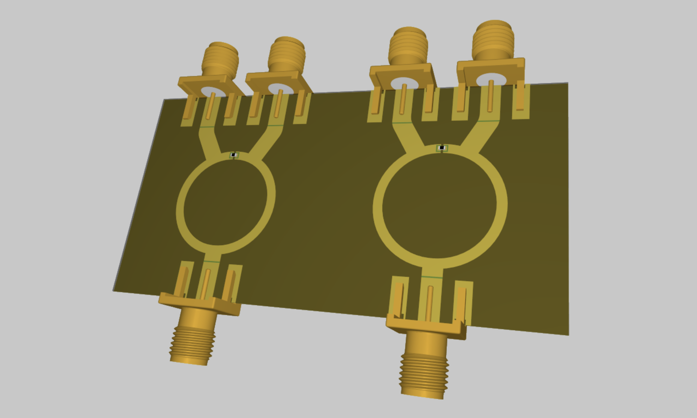
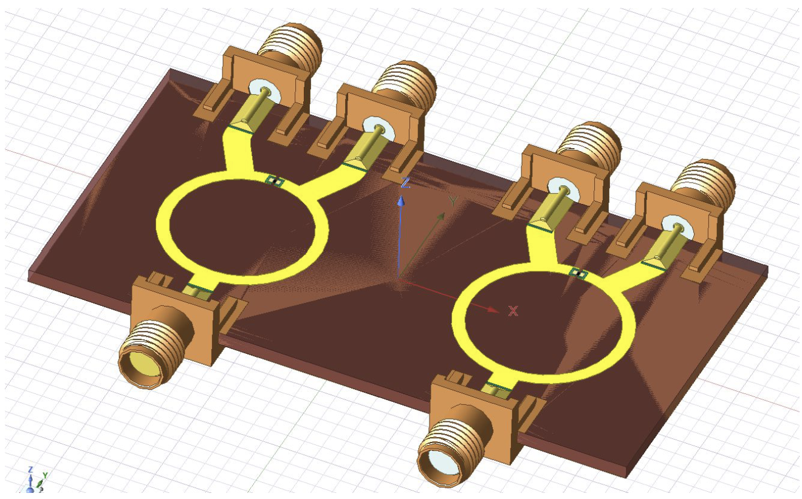
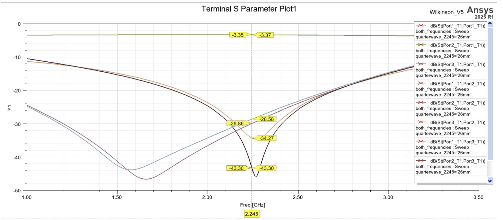
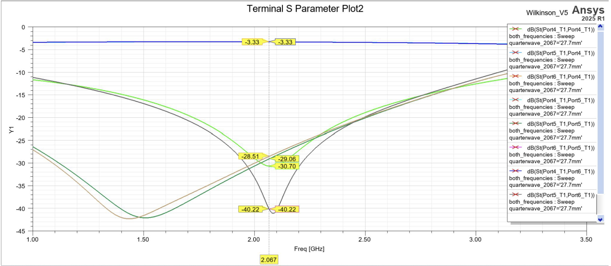

# FR4 Wilkinson Power Divider

This is a S-band dual-channel Wilkinson power divider designed for the UTAT (University of Toronto Aerospace Team) CubeSat RF system. The board splits each RF path from the transceiver (TX @ 2.245 GHz and RX @ 2.067 GHz) into two matched output ports while targeting low insertion loss, good return loss, and isolation between output ports. The split paths are intended to feed two sets of dual patch antennas mounted on opposite sides of the CubeSat.

The design was first simulated in HFSS on FR4 (1.6mm board thickness) as a low cost prototype before potentially moving to a lower loss but more expensive substrate like Rogers. 

## Overview

This project includes: 
- Altium PCB schematic and layout files
- HFSS 3D simulation model
- Simulated S-parameter results for both channels

## Design features

- Two independent Wilkinson divider channels
- 50 Ω input/output ports
- 70.7 Ω quarter-wavelength divider branches
- 100 Ω isolation resistor between output ports (0402 footprint)
- 70mm (W) x 36mm (H) compact board size 
- Solder mask dams added near hand soldered component pads to reduce the risk of solder wicking onto nearby RF traces during assembly
- SMA connector footprints were included in the HFSS model to better capture connector launch effects
- Altium PCB was re-imported into HFSS using EDB to validate the routed layout

## HFSS Model

## Simulation Results

### TX Channel (2.245 GHz)

### RX Channel (2.067 GHz)

## Results Summary

| Channel | Target Frequency | Input Return Loss | Output Return Loss | Excess Insertion Loss | Isolation |
|---|---:|---:|---:|---:|---:|
| TX | 2.245 GHz | -34.27 dB | ~-29 dB | ~0.34 dB | -43.30 dB |
| RX | 2.067 GHz | ~-30.70 dB | ~-28.5 dB | ~-0.32 dB | -40.22 dB |

*Note: Excess insertion loss is calculated relative to the ideal 3.01 dB split of a lossless two-way divider.*

## Next Steps

- Fabricate and assemble the FR4 prototype
- Measure S-parameters using a VNA
- Compare measured results against HFSS simulations
- Consider migration to a lower-loss RF substrate
